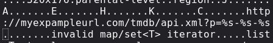

# What's New PS3 Server Files Bundle + API

**Tiny note before we start:** Everything you need is prepackaged into this ZIP file, so you won't need to go online searching for stuff.

**Prerequisites:**
- A Linux server (Debian, Arch, Fedora/RHEL)
- A Windows/Linux machine
- Python 3
- A hex editor
- Copy the "tools used" folder to your local machine for patching

---

## Folder Structure

Understanding how everything is laid out:
```
.
├── xml/
│   ├── BILLBOARDGAME.xml       (used for the game section of XMB PS Store)
│   ├── BILLBOARDVIDEO.xml      (used for the video section of XMB PS Store)
│   ├── BILLBOARDXMBTV.xml      (used for the TV app section of XMB)
│   └── WHATSNEW.xml            (used for the What's New section of XMB)
│
├── tmdb/                        (shows what app was recently launched in What's New)
│   ├── api.xml                 (Python file for redirection - downloads from PS if not found locally)
│   ├── various-xml-files.xml
│   └── images/
│       └── various-images-for-tmdb.png
│
├── images/
│   └── various-images-for-whats-new.png
│
├── download/
│   └── prepatched-for-4.92.2-whats-new.sprx
│
└── whatsnew.php, index.html, patch.html, styles.css
```

**Note:** `whatsnew.php` is the web version of What's New and its different categories, also compatible with the PS3, it is a python program (cgi) that show the page content for the ps3.

---

## Setup Instructions

### Setting Up the Web Server

**Step 1:** Execute the setup script on your Linux server with `python setup.py`

**Step 2:** Enjoy!

---

### Patching explore_plugin.sprx to Use Your Server

**Step 1:** Navigate to the "tools used" folder

**Step 2:** Execute the decrypt script (decrypt.sh or decrypt.bat)

**Step 3:** Open your .prx file with a hex editor

**Step 4:** Edit every `kns-srv2.zapto.org` link to your server address
- **Important:** Do not add characters—replace them!
- You can go past my link, just make sure not to exceed the character space between links

**Step 5:** Execute the encrypt script (encrypt.sh or encrypt.bat)

**Step 6:** On your PS3, enable `/dev_blind`:
- Go to **[Game]** → **[webMAN Games]** → **[webMAN Setup]**
- Scroll down and enable `/dev_blind`

**Step 7:** Connect to your PS3 via FTP

**Step 8:** Navigate to `/dev_blind/vsh/module/`

**Step 9:** Remove the existing `explore_plugin.sprx` and replace it with your patched version

**Step 10:** Reboot your PS3

**Step 11:** Enjoy!

---

### Example of behaviour ###
**to follow**: 



<br>

**to !!not!! follow** (it can cause crash / be ignored if this would be the case):


